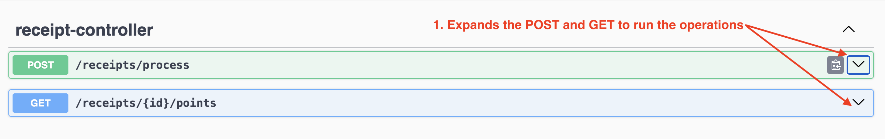
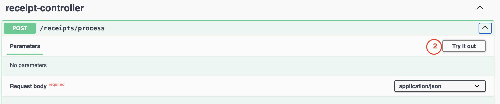

# Instructions to Run the Project

## Prerequisites 
 - Docker installed on your computer. [Install](https://www.docker.com/products/docker-desktop/) 

## Clone the repo to local
``git clone https://github.com/dp4295/Backend-API.git``

## Build the package 
``mvn clean package``

## Build the Docker Image
### Build the Docker image from the Dockerfile
``docker build -t fetch-receipt-process-app .``  [note: Run this command in your root folder] 

### Run the Docker container
``docker run -p 8080:8080 fetch-receipt-process-app`` [note: Run this command in your root folder]
  - Above command will start Spring boot application. 
  - Navigate to http://localhost:8080/swagger-ui/index.html in the browser 

## Run the POST and GET operations in Swagger UI 
  - To proceed with the following pictorial steps, the application must be running. 

  - Step 1: Expands the POST and GET operations to run the operations
    
  - Step 2: Click the 'Try it out' button located in the right corner. This allows you to add value (JSON Object) to Request Body.
    
  - Step 3: Copy below Receipt JSON Object and click Execute to run POST operation with payload
    ```json
    {
        "retailer": "Target",
        "purchaseDate": "2022-01-01",
        "purchaseTime": "13:01",
        "items": [
        {
        "shortDescription": "Mountain Dew 12PK",
        "price": "6.49"
        },{
        "shortDescription": "Emils Cheese Pizza",
        "price": "12.25"
        },{
        "shortDescription": "Knorr Creamy Chicken",
        "price": "1.26"
        },{
        "shortDescription": "Doritos Nacho Cheese",
        "price": "3.35"
        },{
        "shortDescription": "   Klarbrunn 12-PK 12 FL OZ  ",
        "price": "12.00"
        }
        ],
        "total": "35.35"
    }
    ```
    Expected results: 
    ```json
       {
          "id": "3803785b-3124-4b63-9eaa-f9ae758dc925"
       }
    ```
  - Step 4: Copy the id generate from POST payload to execute GET operation

    Expected result: 
    ```json
       {
         "points": 28
       }
    ```

## Addition commands

###  Identify the container ID of the running instance
``docker ps`` 

### Stop the Container
``docker stop <container-id>``


